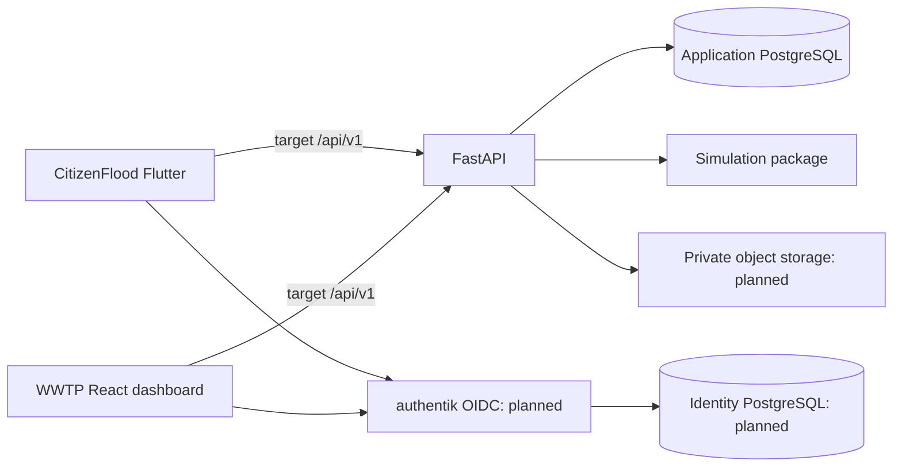

# Architecture and module boundaries

The monorepo coordinates contracts and review. Mobile, web and API remain separate deployables. The root uv workspace combines `services/api` and `packages/simulation`; neither client is bundled into the API process.

This is the target topology. Both imported clients still use legacy Supabase; the dashboard also uses a legacy API contract.

| Boundary | Current interface | Next work |
| --- | --- | --- |
| Persistence | `services/api/app/db`; one Alembic chain | Distinct lab, observation, moderation and account records |
| Scenarios | `routers/scenarios.py`, `routers/simulations.py` | Immutable runs, failure states and capabilities |
| Science | `packages/simulation/wwtp_sim`; model registry | Calibration, independent validation and uncertainty |
| Identity | Temporary Supabase operator adapter | authentik, verified citizens, operator invitation/MFA |
| Presentation | Two `apps/` packages | API-backed repositories and contract compatibility |

The API is a modular monolith owning validation, authorization and persistence. Add domain modules behind service interfaces before introducing distributed services. Clients eventually access application data only through the API. Reviewer/team ownership is pending assignment.

Target mobile login uses an external-browser authorization-code flow with PKCE; web uses a backend-held session and secure cookie. Identity maps uniquely by `(issuer, subject)`, with application roles in the API. Institutional SSO can be brokered through authentik. These login flows are planned.

Citizen observations, laboratory measurements, assumptions and model outputs are distinct data classes. Approved community projections must exclude identity, private notes, exact locations and private media paths. Observations cannot silently become model inputs. See the [roadmap](../migration/ROADMAP.md).
