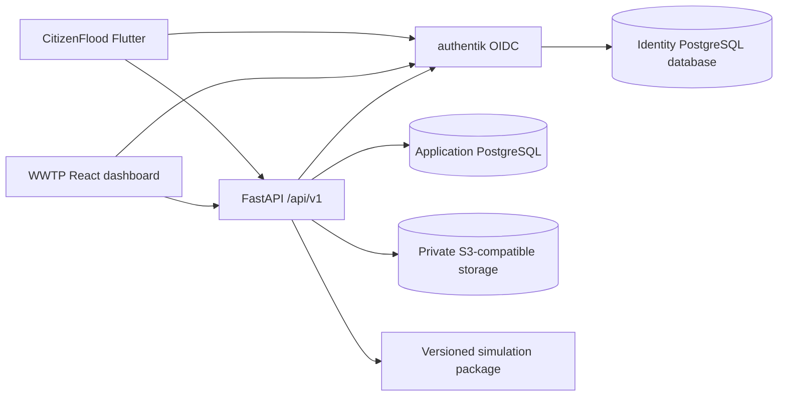

# Shared backend for CitizenFlood and the WWTP dashboard

Date: 2026-10-02

Status: design for user review

Scope: target architecture and migration sequence; no production cutover is authorized by this document

## 1. Intent and success criteria

CitizenFlood remains the citizen reporting product. The WWTP dashboard remains the operator product for monitoring, moderation, and illustrative scenario analysis. Both use one separately deployable FastAPI backend. The backend owns the public HTTP contract, authorization, data rules, persistence, and scientific provenance. Neither client queries database tables or decides object-storage permissions; a client may transfer photo bytes through a backend-issued scoped URL.

The intended standalone deployment uses PostgreSQL, authentik for identity, and private S3-compatible object storage. These are separate backing processes, even if the first deployment shares a physical server. The application must not depend on a Supabase-specific client, token, database function, or Storage path after cutover.

Success means:

1. A registered, verified citizen can submit and revisit only their own reports. An operator can review reports only with the appropriate role. A simulation operator can run scenarios without gaining implicit access to private citizen data.
2. The WWTP dashboard reads monitoring data and approved community observations through the FastAPI contract. Community observations remain distinct from laboratory samples and never become simulation inputs by an implicit join.
3. Every simulation run retains the exact inputs, limits, factors, start date, model artifact identity, outputs, and validation status used at execution. Subsequent edits or deletions of a scenario cannot rewrite or erase that record.
4. Application schema changes follow one reviewed migration chain; authentik manages its separate identity schema. Both client builds verify against the same versioned OpenAPI contract.
5. A restored backup can recover application data, identity data, and private photos. A migration rehearsal reconciles counts, identifiers, checksums, and access decisions before cutover.

## 2. Current baseline and constraints

- CitizenFlood initializes Supabase and signs in anonymously on startup (`citizenflood/lib/main.dart`). Email sign-in is optional (`lib/screens/profile_screen.dart`). `ReportRepository` writes reports and photos directly to Supabase and reads the approved view plus the reporter's own rows.
- The dashboard frontend reads stations, samples, and approved wastewater observations directly with `supabase-js` (`frontend/src/api/monitoring.ts`). Its FastAPI backend handles plants, scenarios, and runs (`backend/app/routers/`). Operator access currently uses Supabase Auth and an email allowlist (`backend/app/operator_auth.py`).
- The dashboard repository owns the shared Supabase migration history. FastAPI separately runs `Base.metadata.create_all()` and a network-dependent plant seed during startup (`backend/app/main.py`, `backend/app/seed/seed.py`). This is not one controlled schema or ingest path.
- The current simulation is a deterministic, uncalibrated heuristic. Weather and rainfall are recorded but do not drive the model. The documented greenhouse-gas estimate is bounded to assumed or supplied influent, selected factors, and recovery terms. It is not a validated operational prediction or complete inventory (`docs/CARBON_ACCOUNTING.md`).
- Existing anonymous report authorship cannot be inferred from a new email address. The migration must preserve those records without silently assigning them to a different person. Existing moderation status may lack a recorded reviewer; migration must mark that provenance as unavailable rather than inventing one.

The two existing repositories and their deployed clients must keep working during preparation. Existing local edits in CitizenFlood are outside this design and must be preserved.

## 3. Approaches considered

| Approach | Benefit | Cost or failure mode | Decision |
| --- | --- | --- | --- |
| Extend dashboard FastAPI code in place and let both clients call it | Fastest first endpoint | Shared platform ownership remains tied to a dashboard release; migration and auth changes become harder to isolate | Use only as a temporary extraction source |
| Extract one modular FastAPI backend with explicit domain modules | One contract and migration chain; independent client releases; scale API replicas without splitting transactions | Requires staged client and data migration | Selected |
| Separate reporting, monitoring, identity, and simulation into microservices now | Independent deployment of every domain | Distributed transactions, more interfaces and operating burden before workload requires them | Defer |

The selected approach is a modular monolith: one application deployment and application database, with identity and object storage as distinct backing processes. Modules expose narrow interfaces internally. A domain module owns its validation and persistence rules; route handlers translate HTTP to that module. We will split a module into a service only when measured load, team ownership, or isolation requirements justify it.

## 4. Runtime architecture and interfaces

The identity database is separate from the application database, with independent credentials and backups. The application stores an internal account ID and a unique `(issuer, subject)` mapping; email is an attribute, not the identity key. FastAPI validates the identity proof and performs authorization against application roles. Identity-provider groups may assist provisioning but are not the sole authorization record.

Citizen accounts use self-registration with verified email. Operator accounts are invited and require MFA. Four application capabilities are distinct: `report:own`, `report:review`, `monitor:read`, and `scenario:operate`; an administrator may assign roles but does not bypass audit logging. A person may hold more than one capability. Institutional SSO is optional: if Monash approves an OIDC or SAML integration, authentik brokers it for operators. This does not alter product endpoints or application account IDs.

The Flutter app uses an external-browser OIDC authorization-code flow with PKCE. The dashboard uses an OIDC authorization-code flow with a backend-held session and secure, HTTP-only cookie. A reverse proxy serves the dashboard and `/api/v1` from one web origin. Session and token lifetimes, logout, CSRF protection, password recovery, rate limits, and MFA recovery are specified and tested in the identity implementation work package. The API rejects a missing, expired, malformed, or unauthorized identity by default.

## 5. Data ownership and public contract

One versioned contract under `/api/v1` serves both clients. FastAPI publishes `/openapi.json` and interactive `/docs`; CI checks that schemas and generated TypeScript and Dart clients remain compatible. The docs include units, examples, authentication, error responses, pagination, and data-quality flags. A common error envelope contains a stable code, readable message, request ID, and field-level details when relevant. Unknown or unsupported enum values are rejected at ingestion rather than silently reinterpreted.

The initial interface groups are:

| Module | Interface operations | Primary rules |
| --- | --- | --- |
| Account | `GET /me`, session/logout integration | Stable identity mapping and role lookup |
| Citizen reporting | Create report, list/read own reports, attach/retrieve own photo | Verified account, ownership, size/type checks, idempotent submission |
| Moderation | Queue, approve/reject with reason, audit history | Reviewer capability, decision timestamp and actor, no public release before approval |
| Monitoring | Plants/stations, paginated lab samples and filters | Source and units retained; observed versus inferred values distinguished |
| Community observations | Paginated approved projections | Only approved rows; rounded public coordinates; no private note, exact GPS, reporter ID, or photo path |
| Scenarios and runs | CRUD scenarios, execute, retrieve, compare, list models | Operator capability; immutable run records; explicit model status |

The application database holds separate tables for accounts and role assignments, citizen reports and moderation events, stations and laboratory samples, model inputs and versions, scenarios, and simulation runs. Foreign keys and uniqueness constraints enforce relationships; check constraints enforce basic measurement shape and ranges. Only the backend database role can read private report data. Public projections are produced by tested backend queries, not by exposing tables to clients. The database remains a defense layer with least-privilege credentials.

Photos live in private object storage. The backend authorizes each upload and download, stores a content hash and media metadata, and issues short-lived scoped access where direct transfer is needed. A report is not marked as containing a usable photo until the upload has completed and its metadata has been committed. Orphan cleanup and restore are part of operations.

## 6. Scientific integrity and model governance

The platform distinguishes **citizen observation**, **laboratory measurement**, **reference factor**, **assumption**, and **model output** as different source classes. Each measurement records source, method when known, unit, observation time, ingest time, quality state, and any applicable detection-limit flag. The system does not promote a citizen's wastewater condition to a laboratory measurement, a legal compliance result, or a simulation input without a separately specified, reviewed transformation.

Each run records an immutable input snapshot, plant configuration and limits snapshot, factor values and source revisions, model ID and version, deploy artifact digest, explicit start date and timezone, execution timestamp, result, and validation status. The run ID is independent of mutable scenario state. Deleting a scenario removes it from active lists but never cascades to runs; an explicit documented retention process governs removal of historical runs. Recalculation creates a new run and a link to the prior run; it does not overwrite the prior record. This is a practical provenance record following the entity/activity/agent distinction in W3C PROV.

The current model remains labelled `illustrative_unvalidated` and `decision_use_permitted=false`. A separate scientific validation work package must define reference datasets, calibration method, train/validation split by time or plant as appropriate, sensitivity and uncertainty analysis, error metrics, failure criteria, and independent review before any stronger claim is made. The application must never infer legal compliance from the present heuristic or unverified site defaults. Model documentation cites primary equations and states the accounting boundary and units.

## 7. Migration and release sequence

This architecture is intentionally split into independently reviewable work packages. Each package receives its own implementation plan and acceptance evidence.

1. **Contract and migration foundation.** Create the shared backend repository from the current FastAPI and simulation code; define module ownership, `/api/v1`, error envelope, OpenAPI checks, and Alembic migrations for the application schema. Remove production schema creation and network seeding from process startup. Retain the current services while this runs in staging.
2. **Identity foundation.** Deploy authentik in staging with a separate PostgreSQL database. Establish verified citizen registration, invited operator MFA, stable identity mapping, and capability checks. Preserve old anonymous reports with their original IDs and status. During a limited migration window, a claimant must present a still-valid old Supabase session whose subject matches the report's old `reporter_id`, then authenticate to the new verified account; record the link and its audit event. Reports without that proof remain unclaimed historical records. Do not match by email alone. Import existing moderation status, marking an absent reviewer as unknown.
3. **Read and data rehearsal.** Import a production-like data copy into staging. Serve plants, samples, and approved community observations through FastAPI. Reconcile API responses against the current database and privacy projection. Prepare the dashboard to consume the API without changing its production data path yet.
4. **Write, media, moderation, and run hardening.** Implement CitizenFlood report, owner-history, and photo flows through the API; add moderation endpoints and an operator workflow to replace Supabase Table Editor. Make runs immutable and replayable. Verify all paths, migration scripts, privacy, and recovery in staging while production still uses the current system.
5. **Deployment and cutover.** Deploy PostgreSQL, authentik, API, and private object storage with TLS, backups, restore rehearsal, logging, metrics, and health checks. Use the rehearsed export/import and a brief write freeze to bring target data current. Compare counts, IDs, hashes, and authorization samples. Release both API-backed clients only after these checks pass; new citizen reports now require a verified account. Disable direct Supabase writes after the new clients pass acceptance. Maintain a rollback snapshot until the acceptance window closes.

The existing dashboard repository remains the source of current production migrations until cutover. The new backend repository becomes the sole source of application migrations at cutover; the old migration chain is frozen and documented. Client releases occur after backend compatibility checks. No dual writes are assumed.

## 8. Failure handling and verification gates

- Identity-provider outage: existing valid sessions follow the defined expiry policy; new logins fail clearly. The API never grants a role because the provider is unavailable.
- Database outage: writes fail without partial report or run records; retryable operations use idempotency keys where duplicate submissions would be harmful.
- Object-store outage: report text submission and photo attachment states are explicit; the UI never claims a photo was stored when it was not.
- Simulation failure: a run records a failed state with an internal trace reference and no fabricated KPIs. The caller receives a stable error code.
- Migration failure: restore is rehearsed in staging, cutover stops on a reconciliation mismatch, and old clients retain a defined rollback route until the acceptance window closes.

Required evidence before cutover includes module and API contract tests, role/ownership and privacy tests, migration tests against production-like PostgreSQL, object-store integrity and restore tests, mobile and web end-to-end paths, simulation golden cases, and a documented load test based on measured expected traffic. Scientific validation is a separate release gate and is not implied by successful software tests.

## 9. Explicit non-goals and open deployment choice

This migration does not claim a calibrated process model, a legal compliance determination, or a complete greenhouse-gas inventory. It does not merge citizen and laboratory datasets. It does not introduce microservices or a generic data platform.

The exact S3-compatible storage product and standalone-server sizing are chosen in the deployment work package after photo volume and expected request load are measured. The interface, privacy rules, backup requirement, and migration checks above are fixed regardless of that product choice. Monash SSO depends on institutional approval; authentik-managed operator accounts provide the defined launch path.

## References

- [OpenAPI Specification](https://spec.openapis.org/oas/) — language-independent HTTP contract.
- [OAuth 2.0 Security Best Current Practice, RFC 9700](https://www.rfc-editor.org/info/rfc9700/) — authorization-code and PKCE requirements.
- [W3C PROV-O](https://www.w3.org/TR/prov-o/) — provenance vocabulary.
- [OWASP Session Management Cheat Sheet](https://cheatsheetseries.owasp.org/cheatsheets/Session_Management_Cheat_Sheet.html) — browser session controls.
- [Alembic documentation](https://alembic.sqlalchemy.org/en/latest/) — tracked SQLAlchemy migrations.
- `docs/CITIZENFLOOD_INTEGRATION.md` and `docs/CARBON_ACCOUNTING.md` — current integration and model limits.
